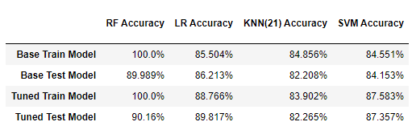

# Machine Learning: Exoplanet Exploration

## Background
Over a period of nine years in deep space, the NASA Kepler space telescope has been out on a planet-hunting mission to discover hidden planets outside of our solar system.

This project uses the data they gathered to train four machine learning (ML) models those are intended to classify candidate exoplanets.

## Models
- Logistic Regression (LR)
- Random Forest (RF)
- K Nearest Neighbor (KNN)
- Support Vector Machine (SVM)
- Deep Learning Model

### Model Design Approach
- Build a base model using the original dataset and all its 40 features.
- Use the base model to evaluate feature importance.
- Tune the model parameters using *GridSearchCV*.
- Build the final model using the tuned parameters.

## Model Comparison
Deep Neural Network - Loss: 0.2539210319519043, Accuracy: 0.9073226451873779
The RF model was the more accurate of the four by a small margin.

## Conclusions
Evidently, given the relatively high accuracy of the Random Forest Model and the Deep Learning Model, I believe them both to be reasonable predictor of exoplanet candidacy. However, a model leveraging deep learning techniques might prove superior.
